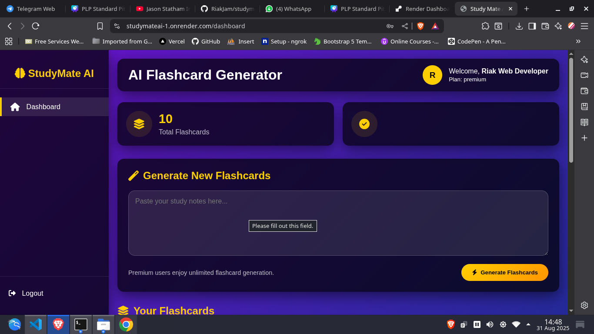

# 📚 StudyMate AI  

StudyMate AI is a smart study companion that generates **AI-powered flashcards** from notes, textbooks, or custom input.  
It also integrates **Paystack payments** to handle subscriptions and premium access.  

---

## ✨ Features  

- 🧠 **Flashcard Generator** – Converts text into flashcards using AI.  
- 📊 **Smart Revision** – Uses spaced repetition for better memory retention.  
- 💳 **Paystack Integration** – Secure payments for premium features.  
- 🔐 **User Accounts** – Save flashcards, track progress, and manage subscriptions.  
- 🌐 **Web-based App** – Built with Python, HTML, CSS, and JavaScript.  
- 📈 **Analytics Dashboard** – Monitor study progress.  

---

## 🛠️ Tech Stack  

- **Backend**: Python (Flask)  
- **Frontend**: HTML, CSS, JavaScript  
- **Database**: PostgreSQL  
- **Payments**: [Paystack](https://paystack.com)  

## Payment API are testing APIs not life. 
---
## Deployed Website

The website is deployed on render, under a free plan package. 
NOTE: If the website is not accessed recently it sleeps and render will take some few seconds to start the website

[Live](https://studymateai-1.onrender.com/)

## Pitch Deck Presentation link

[Link](https://www.canva.com/design/DAGxoq9Coro/VGoQYJ03x6AZuZqDMuNuJg/edit?utm_content=DAGxoq9Coro&utm_campaign=designshare&utm_medium=link2&utm_source=sharebutton)

## AI Prompt
 Create an AI website that generates flashcards and store the flashcards to the postgressql database.
 Create the following pages. Use flask in the python file, postgress sql schema and remote render connection. The html pages page should use the following colors. 
  --primary: #ffce00;      
  --secondary: #6a5acd;    
  --accent: #00d4ff;       
  --light: #fdf6f0;        
  --dark: #1e1e2f;         
  --success: #32cd32;      
  --text-light: #1e1e2f;
  --text-dark: #fdf6f0;
 app.py
 index.html - Landing page
 dashboard.html - Flashcard generation and subscriptions
 premium.html - subscriptions using paystack
 login.html 
 signup.html

 Create the postgressql schema. Database name hackerthone_db, tables flashcards and users. 
 The flashcards table is for storing questions and answers and the user id
 THe users table is to store user's info, plan (free, basic/premium)

 


## Websites pictures

### Landning page


### Dashboard


### Demo - Signup - Signin - Flashcard generation free / premium and account upgrade 

[Video Link](https://www.canva.com/design/DAGxpDHhYqs/x1CcZ8LOXBarMD0w13ZbFg/edit?utm_content=DAGxpDHhYqs&utm_campaign=designshare&utm_medium=link2&utm_source=sharebutton)


## ⚙️ Installation  

### 1. Clone the repository  
```bash
git clone https://github.com/RiakJam/studymateai

